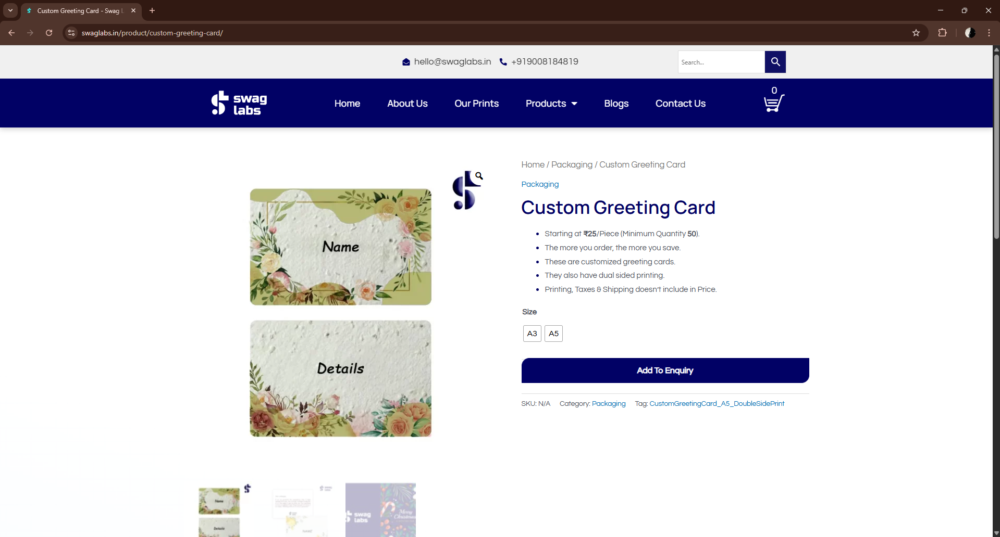

# 🧪 Cenários de Teste

## 🔹 Página do Produto

* Validar carregamento da página do produto
* Validar exibição correta das informações (nome, descrição, preço)
* Validar imagens do produto
* Validar responsividade básica da página

## 🔹 Personalização do Produto

* Inserir texto válido no campo de personalização
* Tentar prosseguir sem preencher campos obrigatórios
* Inserir caracteres especiais
* Inserir texto muito longo (limite)

## 🔹 Carrinho

* Adicionar produto ao carrinho
* Adicionar produto sem personalização (quando obrigatório)
* Alterar quantidade do produto
* Remover produto do carrinho

## 🔹 Fluxo de Compra

* Iniciar checkout com produto no carrinho
* Preencher dados obrigatórios corretamente
* Tentar avançar com campos vazios
* Validar continuidade do fluxo até finalização

## 🔹 Cenários Negativos

* Submeter formulário com dados inválidos
* Interromper fluxo no meio do checkout
* Executar ações fora do fluxo esperado (ex: atualizar página durante checkout)

# 📋 Casos de Teste

## 🔐 CT-01: Acesso à página do produto

**Pré-condição:** Usuário com acesso à internet

**Passos:**
1. Acessar a URL da página do produto
2. Aguardar carregamento completo

**Resultado esperado:**
* A página deve carregar corretamente
* Todas as informações do produto devem ser exibidas (nome, descrição, preço)
* Imagens devem ser carregadas sem erro

**Resultado obtido:**
Passou

**Observações:**
Página carregou corretamente, todas as informações visíveis e imagens exibidas sem erro

**Evidência:**

---

## 📝 CT-02: Inserir personalização válida

**Pré-condição:** Página do produto carregada

**Passos:**

1. Inserir texto válido no campo de personalização
2. Verificar se o campo aceita o conteúdo

**Resultado esperado:**

* O sistema deve aceitar o texto inserido
* Nenhuma mensagem de erro deve ser exibida

---

## ❌ CT-03: Tentar prosseguir sem preencher personalização obrigatória

**Pré-condição:** Campo de personalização obrigatório

**Passos:**

1. Não preencher o campo
2. Tentar adicionar ao carrinho

**Resultado esperado:**

* O sistema deve impedir a ação
* Deve ser exibida uma mensagem de erro indicando campo obrigatório

---

## 🛒 CT-04: Adicionar produto ao carrinho

**Pré-condição:** Produto configurado corretamente

**Passos:**

1. Clicar em "Adicionar ao carrinho"

**Resultado esperado:**

* O produto deve ser adicionado ao carrinho
* O contador do carrinho deve ser atualizado
* Deve haver feedback visual da ação (ex: mensagem ou mudança no botão)

---

## 🔄 CT-05: Alterar quantidade do produto

**Pré-condição:** Produto no carrinho

**Passos:**

1. Acessar carrinho
2. Alterar quantidade do item

**Resultado esperado:**

* A quantidade deve ser atualizada corretamente
* O valor total da compra deve ser recalculado

---

## 🗑️ CT-06: Remover produto do carrinho

**Pré-condição:** Produto no carrinho

**Passos:**

1. Clicar em remover item

**Resultado esperado:**

* O produto deve ser removido do carrinho
* O carrinho deve refletir a remoção imediatamente

---

## 💳 CT-07: Iniciar checkout

**Pré-condição:** Produto no carrinho

**Passos:**

1. Clicar em finalizar compra

**Resultado esperado:**

* O usuário deve ser redirecionado para a página de checkout
* A página deve carregar corretamente

---

## ⚠️ CT-08: Validar campos obrigatórios no checkout

**Pré-condição:** Página de checkout aberta

**Passos:**

1. Deixar campos obrigatórios vazios
2. Tentar avançar

**Resultado esperado:**

* O sistema deve impedir o avanço
* Mensagens de validação devem ser exibidas indicando os campos obrigatórios

---

## ✅ CT-09: Finalizar compra com sucesso

**Pré-condição:** Dados válidos preenchidos

**Passos:**

1. Preencher todos os campos obrigatórios
2. Confirmar compra

**Resultado esperado:**

* O sistema deve concluir o pedido com sucesso
* O usuário deve visualizar uma mensagem ou página de confirmação da compra

---

## 🚫 CT-10: Inserir dados inválidos no checkout

**Pré-condição:** Página de checkout aberta

**Passos:**

1. Inserir dados inválidos (ex: email incorreto)
2. Tentar continuar

**Resultado esperado:**

* O sistema deve bloquear o avanço
* Deve exibir mensagens de erro indicando os campos inválidos
