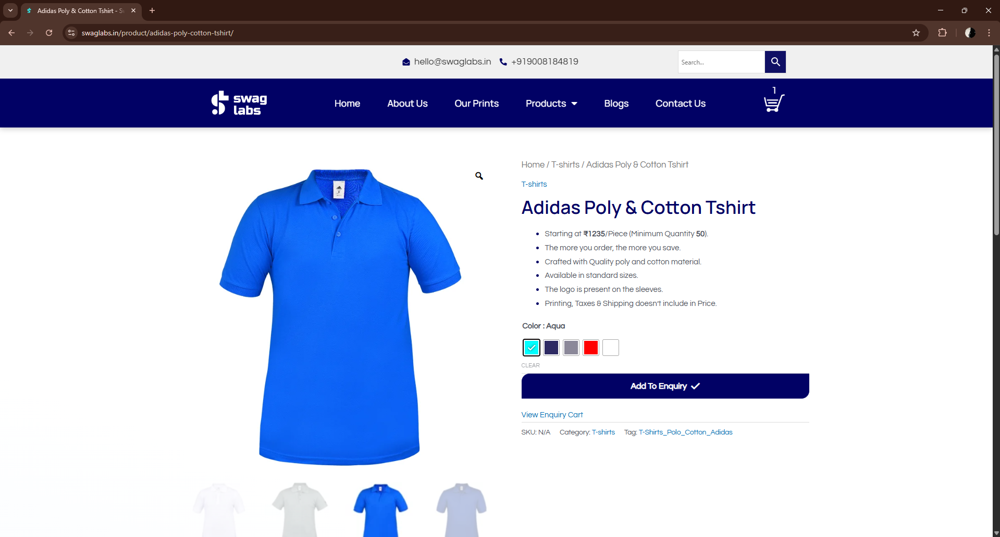
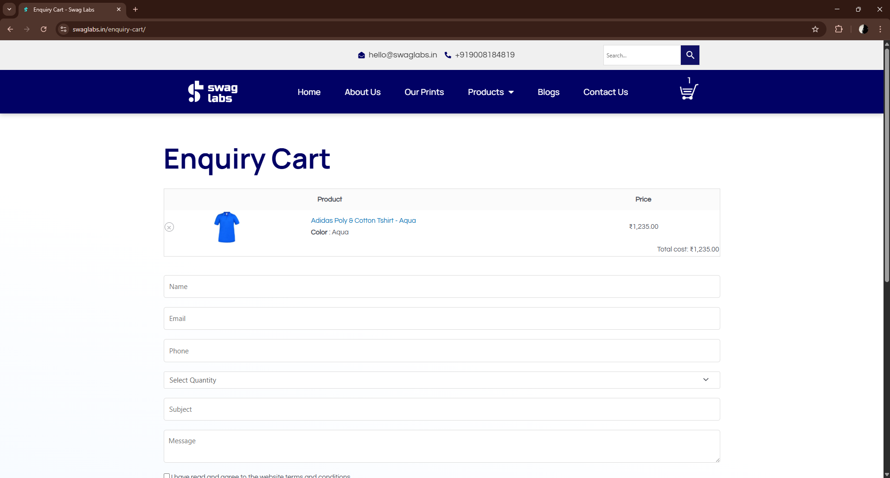
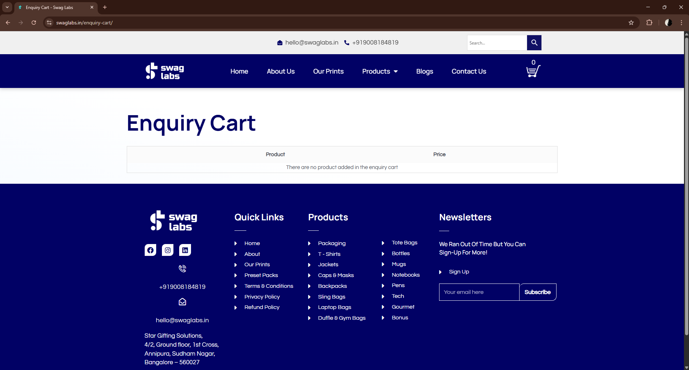
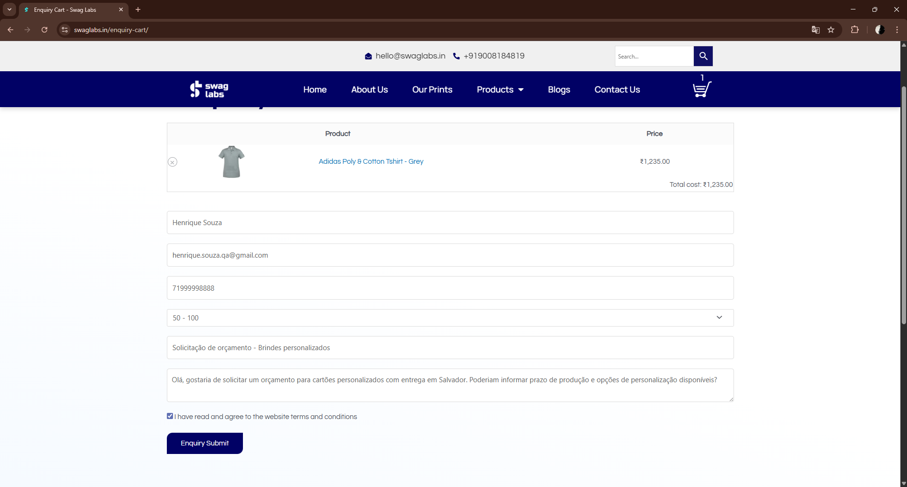

# 📋 Casos de Teste

## 🔐 CT-01: Acesso à página do produto

**Pré-condição:** Usuário com acesso à internet

**Passos:**
1. Acessar a URL da página do produto
2. Aguardar carregamento completo

**Resultado esperado:**
* A página deve carregar corretamente
* Todas as informações do produto devem ser exibidas (nome, descrição, preço)
* Imagens devem ser carregadas sem erro

**Resultado obtido:**
Passou

**Observações:**
Página carregou corretamente, todas as informações visíveis e imagens exibidas sem erro

**Evidência:**

---

## 🛒 CT-02: Adicionar produto ao carrinho

**Pré-condição:** Página do produto carregada

**Passos:**
1. Clicar no botão "Add to Enquiry"
2. Observar o comportamento do sistema após a ação

**Resultado esperado:**
* O produto deve ser adicionado ao carrinho
* O ícone do carrinho deve ser atualizado (quantidade)
* O sistema deve apresentar feedback visual da ação (ex: mensagem ou mudança no botão)

**Resultado obtido:**
Passou

**Observações:**
O produto foi adicionado ao carrinho com sucesso. O ícone do carrinho foi atualizado corretamente e houve feedback visual da ação.

**Evidência:**

---

## 🛒 CT-03: Acessar o carrinho

**Pré-condição:** Produto adicionado ao carrinho

**Passos:**
1. Clicar no ícone do carrinho
2. Acessar a página do carrinho

**Resultado esperado:**
* O usuário deve ser redirecionado para a página do carrinho
* O produto adicionado deve estar listado no carrinho
* As informações do produto devem estar corretas (nome, quantidade)

**Resultado obtido:**
Passou

**Observações:**
O carrinho foi acessado com sucesso. O produto adicionado foi exibido corretamente, com nome e quantidade conforme esperado.

**Evidência:**

---

## 🗑️ CT-04: Remover produto do carrinho

**Pré-condição:** Produto adicionado ao carrinho

**Passos:**
1. Acessar o carrinho
2. Localizar o produto adicionado
3. Clicar na opção de remover item

**Resultado esperado:**
* O produto deve ser removido do carrinho
* O carrinho deve ser atualizado imediatamente
* O sistema deve refletir corretamente a remoção (ex: carrinho vazio ou atualização da lista)

**Resultado obtido:**
Passou

**Observações:**
O produto foi removido do carrinho com sucesso. A interface foi atualizada imediatamente, sem necessidade de recarregar a página, refletindo corretamente a remoção.

**Evidência:**

---

## 🛒 CT-05: Acessar carrinho sem produtos

**Pré-condição:** Nenhum produto adicionado ao carrinho

**Passos:**
1. Acessar o carrinho
2. Observar o comportamento da página ao carregar
3. Interagir com a página (ex: mover o mouse)

**Resultado esperado:**
* O carrinho deve exibir corretamente o estado vazio
* Deve ser exibida uma mensagem informando que não há produtos no carrinho
* A interface deve permanecer estável sem alterações inesperadas

**Resultado obtido:**
Falhou

**Observações:**
Foi possível acessar o carrinho normalmente. Inicialmente, a página exibiu campos relacionados ao preenchimento de dados para compra. No entanto, ao mover o mouse, a página foi atualizada automaticamente e esses campos desapareceram, retornando para o estado correto de carrinho vazio com a mensagem "There are no product added in the enquiry cart". Esse comportamento indica inconsistência na renderização da interface.

**Evidência:**

---

## 📄 CT-06: Preencher formulário de enquiry com produto no carrinho

**Pré-condição:** Produto adicionado ao carrinho

**Passos:**
1. Acessar o carrinho
2. Verificar se o produto está listado
3. Localizar o formulário de enquiry
4. Preencher os campos obrigatórios

**Resultado esperado:**
* O usuário deve conseguir acessar o formulário de enquiry
* O formulário deve ser exibido corretamente
* Os campos obrigatórios devem estar visíveis e preenchíveis
* A interface deve permanecer estável durante a interação
* O usuário deve conseguir preencher todos os campos

**Resultado obtido:**
Passou

**Observações:**
O formulário foi acessado e preenchido com sucesso. Todos os campos obrigatórios estavam funcionais. O campo de quantidade permite apenas a seleção de valores pré-definidos (ex: 50, 100), sem opção de entrada manual. De acordo com o contexto da aplicação, esse comportamento está alinhado com a proposta da empresa de atender pedidos em escala. No entanto, a interface não deixa essa limitação explícita, o que pode gerar dúvida para usuários que esperam inserir quantidades menores.

**Evidência:**

---

---

