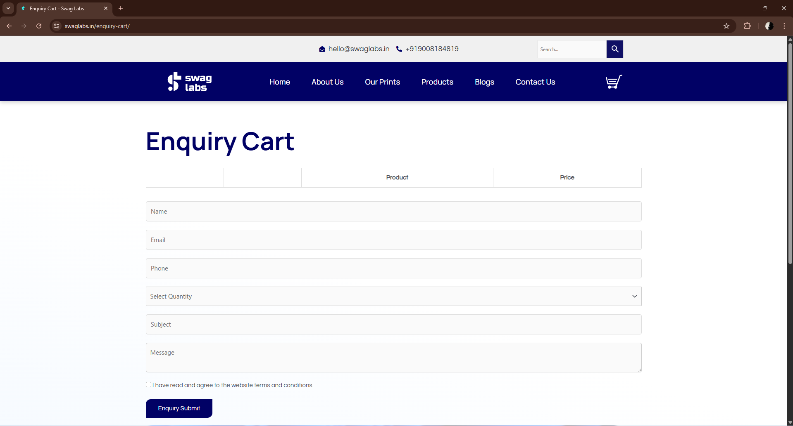

## 🐞 BUG-01

**Título:**
[Carrinho] Inconsistência ao carregar carrinho vazio

**Ambiente:**
Chrome (versão atual), Windows 11, SwagLabs

**Passos para Reproduzir:**
1. Acessar o site;
2. Entrar no carrinho sem adicionar produtos;
3. Observar a tela inicial;
4. Mover o mouse pela página

**Resultado Atual:**  
A página inicialmente exibe campos de formulário de forma incorreta. Após movimentação do mouse, a interface é atualizada e retorna ao estado correto de carrinho vazio com a mensagem "There are no product added in the enquiry cart".

**Resultado Esperado:**  
A página deve carregar diretamente no estado correto de carrinho vazio, sem exibir elementos inconsistentes.

**Severidade:**  
Média

**Evidência:**  

---

## 🐞 BUG-02

**Título:**  
[Formulário] Campo Nome aceita valores numéricos

**Ambiente:**  
Chrome (versão atual), Windows 11, SwagLabs

**Passos para Reproduzir:**
1. Acessar o formulário de enquiry;
2. Inserir valores numéricos no campo Nome (ex: "123456");
3. Preencher os demais campos corretamente;
4. Enviar o formulário

**Resultado Atual:**  
O sistema permite a inserção e envio de valores numéricos no campo Nome sem validação.

**Resultado Esperado:**  
O campo Nome deve aceitar apenas caracteres válidos (letras) e impedir envio com valores inválidos.

**Severidade:**  
Baixa

**Evidência:**  
(link do vídeo ou imagem)
